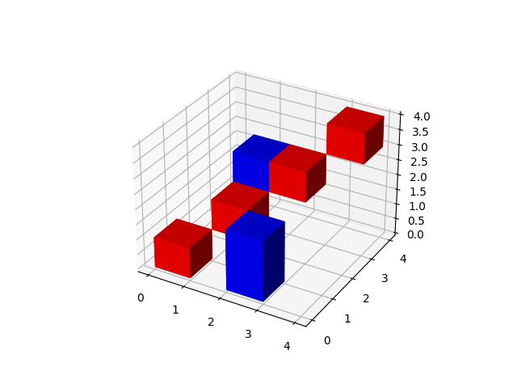

# 3-dimensional tic-tac-toe with variable grid size

## Pre-requisites
* Python 3.10
* Poetry 1.2.2

## Install 

```bash
poetry install
```

## Run

```bash
python tictactoe/tictactoe.py --help
```

```bash
Usage: tictactoe.py [OPTIONS]

Options:
  --size TEXT        Size of the grid
  --plot             Whether to plot the board in 3D
  --help             Show this message and exit.
```

### Example

```bash
# 4x4x4 cube with plotting
$ python tictactoe/tictactoe.py --size 4 --plot
Player 1, pick your next move in the range (0,0,0) to (4, 4, 4) or type 'exit' to quit the game
>>> (0,0,0)
Player 2, pick your next move in the range (0,0,0) to (4, 4, 4) or type 'exit' to quit the game
>>> (2,0,1)
Player 1, pick your next move in the range (0,0,0) to (4, 4, 4) or type 'exit' to quit the game
>>> (1,1,1)
Player 2, pick your next move in the range (0,0,0) to (4, 4, 4) or type 'exit' to quit the game
>>> (1,2,2)
Player 1, pick your next move in the range (0,0,0) to (4, 4, 4) or type 'exit' to quit the game
>>> (2,2,2)
Player 2, pick your next move in the range (0,0,0) to (4, 4, 4) or type 'exit' to quit the game
>>> (2,0,0)
Player 1, pick your next move in the range (0,0,0) to (4, 4, 4) or type 'exit' to quit the game
>>> (3,3,3)
Player 1 has won! Congrats!
```



## Test

```bash
poetry install
poetry run pytest
```


